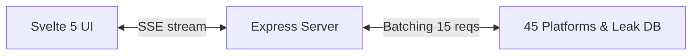

# Antigravity OSINT Tracker

## 🎯 1. Mục Đích Bài Lab
*   **Mục tiêu**: Xây dựng công cụ thám báo nguồn mở (OSINT) truy tìm tài khoản qua Username/Email trên **45 nền tảng**.
*   **Kỹ thuật cốt lõi**: Xử lý bất đồng bộ quy mô lớn (Axios Batching 15 song song / 100ms delay), truyền phát sự kiện thời gian thực bằng Express **Server-Sent Events (SSE)**, và thiết kế UI phản ứng bằng **Svelte 5 Runes**.

---

## 🏛️ 2. Thiết Kế Hệ Thống

### Sơ đồ Luồng Hoạt Động (System Design Diagram)



## 🔄 3. Luồng Hoạt Động Của Web
1.  **Input**: Người dùng nhập Username/Email, hệ thống tự nhận diện và lọc qua bộ kiểm dịch an toàn 6 bước.
2.  **SSE Connection**: Client thiết lập kênh lắng nghe thời gian thực `EventSource` đến Server.
3.  **Scanning**: Server quét song song các trang web theo từng đợt batch 15 và gửi sự kiện `result` lập tức về client.
4.  **Display**: Client nhận diện và **chỉ hiển thị** thẻ của các tài khoản được tìm thấy (`FOUND`) kèm link liên kết.
5.  **Dossier**: Kết thúc quét, hệ thống hiển thị tóm tắt và cho phép người dùng tải Báo cáo PDF.

---

## 💻 4. Hướng Dẫn Cài Đặt (Setup & Run)

### Yêu cầu
*   Node.js >= 18.x

### Khởi chạy Backend (Cửa sổ Terminal 1)
```bash
cd be
npm install
npm run dev
```

### Khởi chạy Frontend (Cửa sổ Terminal 2)
```bash
cd fe
npm install
npm run dev
```

### Author - devonxjz