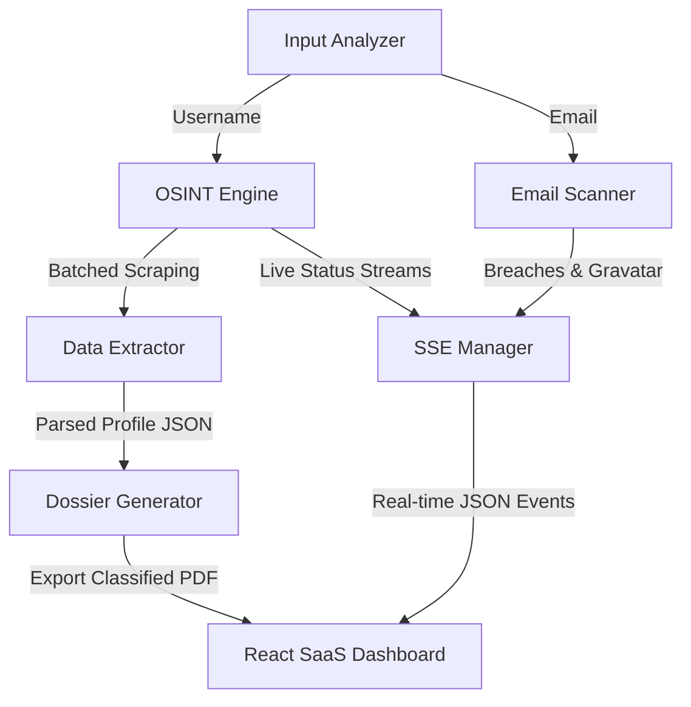

# PRD & Module Specifications: Digital Footprint Tracker (OSINT)

---

## 1. Product Requirement Document (PRD)

### Problem Statement
User wants to track digital footprints cross-platform without manual searches. Existing tools (Sherlock) are command-line only, slow, lack real-time visual progress, and cause IP blocking due to uncontrolled concurrency. Additionally, students/investigators need clean, readable reports (PDF) for academic/forensic documentation.

### Solution
Build a premium, high-performance web application featuring:
1. **Curated & categorized multi-platform search** (Tech, Social, Gaming, Media).
2. **Stealthy chunked execution engine** with configurable delay and anti-rate-limit measures.
3. **Hybrid Input Analyzer** (auto-routing Email vs Username).
4. **Real-time scanning progress stream** via Server-Sent Events (SSE) visualized in a clean modern SaaS dashboard.
5. **Offline/Online breach scanner** combining Gravatar MD5 lookup and HaveIBeenPwned (HIBP) hybrid engine.
6. **Classified FBI/Military-style PDF Dossier Generator** summarizing findings.

---

### User Stories

1. As an investigator, I want to input an alias, so that I can automatically check its existence across 40+ platforms.
2. As a user, I want the system to auto-detect if I input an email or a username, so that the system runs the correct search pipeline.
3. As a student, I want to filter platform categories (e.g., only scan "Tech" sites), so that I can make scans faster and target-focused.
4. As an investigator, I want to see real-time progress of the scanning on a terminal-like log screen and a progress bar, so that I know the scan is running and not hung.
5. As a privacy researcher, I want to check my email for public data breaches without paying for an API key, so that I can use a high-fidelity simulated breach database.
6. As a professional investigator, I want to input my HIBP API key, so that I can perform a live data breach lookup for my target email.
7. As an analyst, I want to see a preview of target profiles (bios, avatars, locations) directly in the UI, so that I can verify target identity.
8. As a user, I want to export findings into a top-secret-styled PDF dossier, so that I can save or submit investigations as lab evidence.
9. As a night worker, I want a sleek SaaS light/dark mode switch, so that the UI is comfortable to use in any lighting condition.

---

### Implementation Decisions

*   **Architectural Model**: Client-Server split (React frontend + Express Node.js backend).
*   **Data Storage**: RAM-only. Scan results processed in-memory and pushed down via SSE. PDF generated on the fly.
*   **Concurreny Strategy**: Concurrency chunking. Search targets are divided into batches of 15. The server executes each batch, delays 100ms, then proceeds.
*   **SSE Channel**: `/api/scan?target=XYZ&categories=tech,social` opens a persistent text/event-stream connection pushing JSON chunks.

---

### Testing Decisions
*   **Deep Isolation Testing**: Test modules directly bypassing the network or express HTTP layer.
*   **Mock Network Requests**: Standard HTTP calls mocked to verify chunking delays and edge cases (404, 200, redirect, block).
*   **HTML Scraping Verification**: Test cheerio extractors against saved local HTML fixtures to prevent regression when platforms update structures.

---

### Out of Scope
*   **Active OSINT (Intrusive)**: Authenticated scans, logging into platforms using fake accounts, or brute forcing passwords.
*   **Proxy Rotation Pool**: While proxy configuration is supported, maintaining a built-in proxy proxy provider subscription is out of scope.
*   **DB Persistent Search History**: Storing target results long-term is deferred to future SQLite phase.

---

## 2. Module Specifications



### Module 1: Input Analyzer (`backend/src/analyzer.js`)
*   **Type**: Pure Deep Utility.
*   **Responsibility**: Detect if search input is email, standard username, or invalid format.
*   **Interface**:
    ```javascript
    function analyzeInput(term) {
      // Returns { type: 'EMAIL' | 'USERNAME', valid: boolean, sanitized: string }
    }
    ```

### Module 2: Platform Registry (`backend/src/registry.js`)
*   **Type**: Data Config & Registry.
*   **Responsibility**: Store platform schemas, categories, false-positive detection models.
*   **Schema Rule Shape**:
    ```typescript
    interface Platform {
      name: string;
      category: 'Tech' | 'Social' | 'Gaming' | 'Media';
      url: string; // Target URL replacing username in "{}"
      checkType: 'status' | 'text' | 'selector';
      checkValue: number | string;
    }
    ```

### Module 3: OSINT Engine (`backend/src/scanner.js`)
*   **Type**: Async Network Processing Module.
*   **Responsibility**: Perform chunked asynchronous searching, rotate user agents, catch false positives.
*   **Interface**:
    ```javascript
    async function scanPlatform(username, platform) {
      // Returns Promise<ScanResult>
      // ScanResult: { platform: string, status: 'FOUND' | 'NOT_FOUND', url: string, bio?, avatar?, location? }
    }
    ```

### Module 4: Email Scanner (`backend/src/emailScanner.js`)
*   **Type**: API Aggregator Module.
*   **Responsibility**: Generate MD5 hash, run Gravatar lookup, check HIBP API or fallback to mock database.
*   **Interface**:
    ```javascript
    async function scanEmail(email, kibpApiKey = null) {
      // Returns Promise<{ exists: boolean, avatar: string, breaches: Array<Breach> }>
    }
    ```

### Module 5: SSE Connection Manager (`backend/src/routes/scan.js`)
*   **Type**: Stream Orchestration Middleware.
*   **Responsibility**: Open SSE channel, listen to OSINT Engine output, transmit structured JSON stream in real-time.
*   **Stream Event Types**:
    *   `event: progress` -> `{ completed: number, total: number, percentage: number }`
    *   `event: result` -> `{ platform: string, status: 'FOUND' | 'NOT_FOUND', url: string, bio?, avatar? }`
    *   `event: error` -> `{ platform: string, error: string }`
    *   `event: end` -> `{ summary: { foundCount: number, timeTakenMs: number } }`

### Module 6: Dossier Generator (`backend/src/utils/pdf.js`)
*   **Type**: Document Rendering Pipeline (No State).
*   **Responsibility**: Build structure-heavy classified PDF report from final parsed scan payload.
*   **Interface**:
    ```javascript
    async function generateDossierPDF(reportData, writeStream) {
      // Writes top-secret structured PDF directly into output stream
    }
    ```

### Module 7: SaaS Dashboard UI (`frontend/src/`)
*   **Type**: User Interface.
*   **Responsibility**: Handle state of active scan, render beautiful cards, stream logs in log console, support theme toggling.
*   **Components**:
    *   `<SearchBar />`: auto-validates patterns.
    *   `<PlatformGrid />`: displays categorized network grids with color-coded status badges.
    *   `<LogStreamer />`: console logging area with autoscroll.
    *   `<BreachCard />`: visual warning lists for pwned emails.
    *   `<DossierExport />`: preview metadata card with download CTA.
